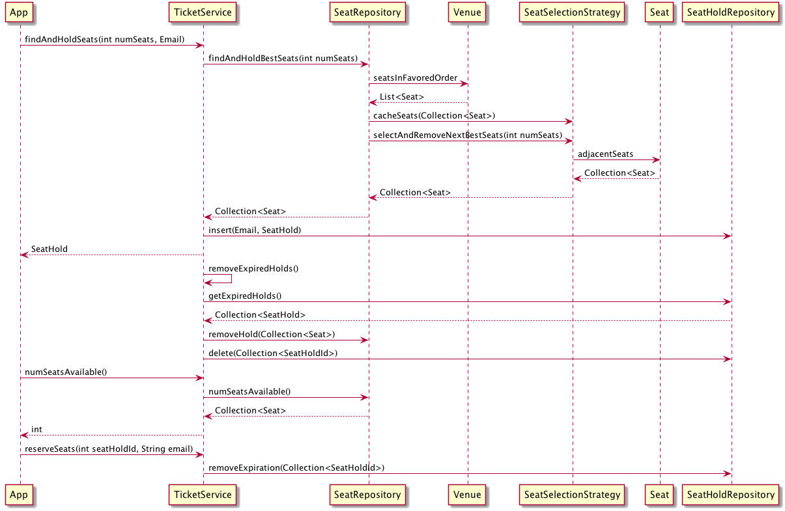

# Ticket Challenge

## Preliminary Thoughts
- Need to classify "high performance". Largest stadium in the world has a capacity of [150,000](https://www.worldatlas.com/articles/50-largest-stadiums-in-the-world.html). Without further investigation, serving 150,000 requests/sec seems to be a reasonable upper performance bound. Looking at some [benchmarking data](https://dzone.com/articles/benchmarking-high-concurrency-http-servers-on-the) we are on the edge of what is possible. The machine in those benchmarks is relatively small, and 150,000 is relatively high, so a Java app should "just work" without any special performance considerations, at least to start.
- For high-availability it'd be nice to make the app stateless. We should be fine getting the above throughput with a standard relational database (e.g. MySQL or Postgres), so we will have an in-memory repository here that we know could be replaced easily without much concern around performance.

## Overall Gist
Here is a mostly up-to-date sequence diagram to explain what is happening:



It is a spring boot application (for dependency injection and helpers like @Scheduled). There are some integration level tests in the test file `TicketServiceTest.java`. You can run all the tests via the below command. Note that they take a minute or two, as the integration tests initialize a Spring context a few times (since some tests dirty the context), as well as wait for certain eventually-consistent conditions.
```bash
./gradlew test
```

While I would be happy with the state of the code for an initial deploy, there are a number of follow-up items I would address in the short-term:
- Split into smaller packages. Right now everything is in one big package
- Add a randomized stress test. While the existing tests give me confidence, my experience with concurrent code is that it is easy to have bugs, so some kind of larger stress test would help expose those
- The existing `DumbSeatSelectionStrategy` right now is very dumb. It doesn't even group seats to ensure that customers are getting seats that are next to each other. If I was to extend it, I would create a graph of seats by adding `adjacentSeats` and `score` methods to the `Seat` class. Then you could find a set of seats with at least one adjacent to each other and take the average score. After that, I would consider more advanced scoring options (e.g. seats in a 2x2 square might be preferable to a line of 4 seats, i.e. 4x1, even if it was one row back). This is reflected in the sequence diagram.
- The `SeatRepository` dependency on `Venue` and `SeatSelectionStrategy` stands out as something wrong to me. I think there might be a missing `SeatService` level that has a dependency on all three of those interfaces, but I am still thinking  on this.
- Update the `TicketService` documentation to reflect the possible exceptions it can throw.

